# Resume Intelligence Hub

Event-driven resume processing platform built as a **Turborepo monorepo**. Upload a PDF resume and the system automatically extracts text via OCR, parses skills and experience using NLP, matches against active job roles, and surfaces live analytics — all asynchronously through a BullMQ worker pipeline.

## UI Preview

| Login | 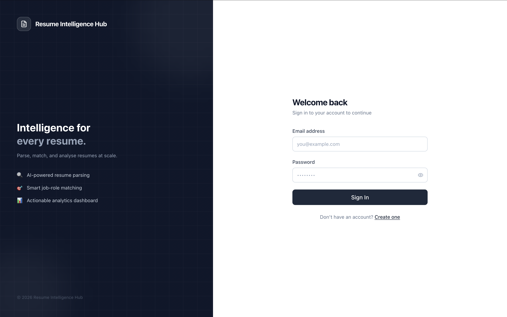 |
| Register | 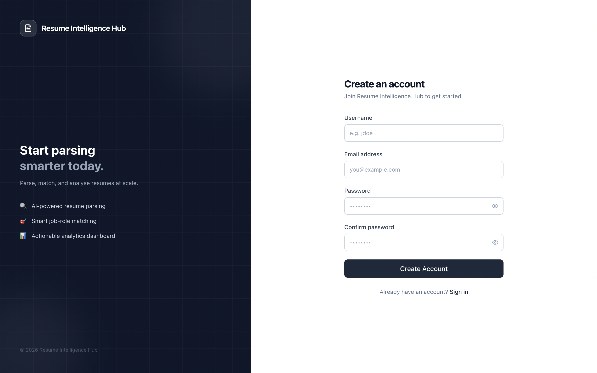 |
| Dashboard — Analytics | 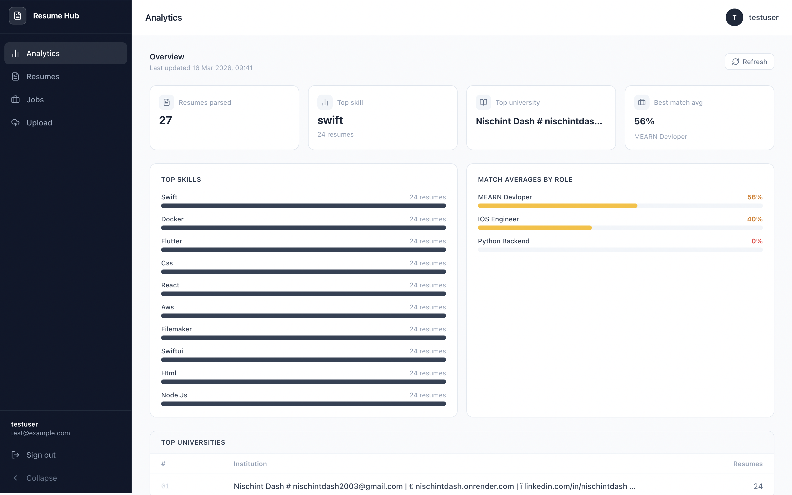 |
| Dashboard — Jobs | 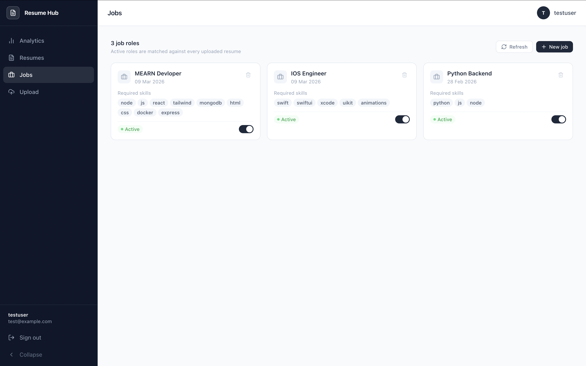 |
| Dashboard — Resumes | 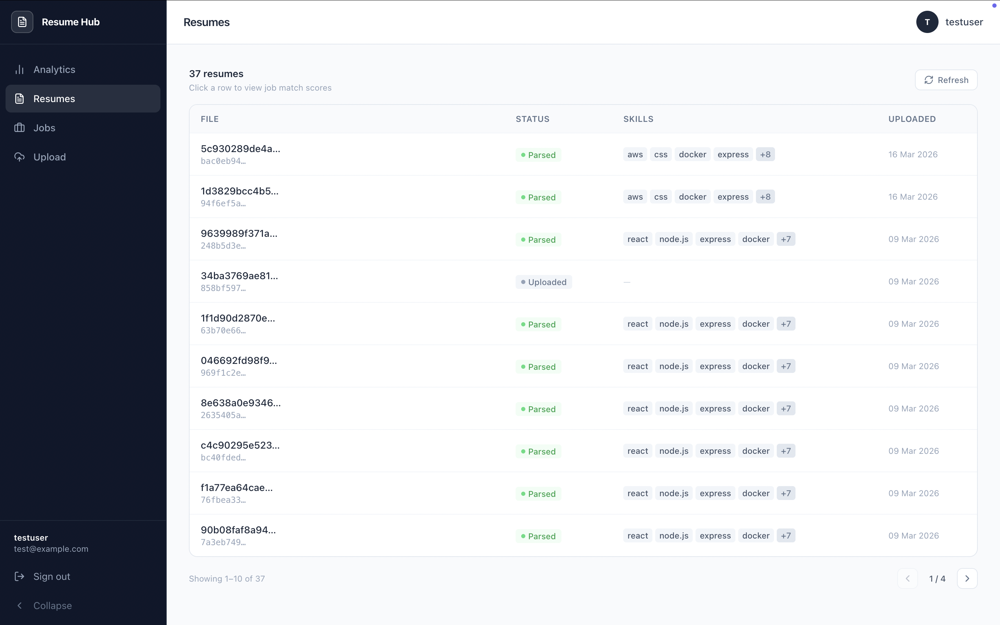 |
| Dashboard — Upload | 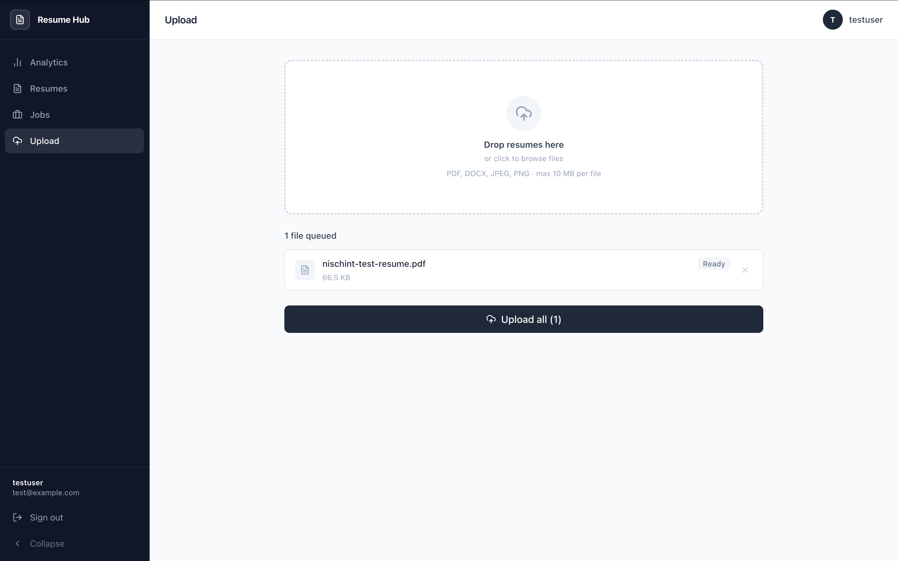 |
| Match Score Panel | 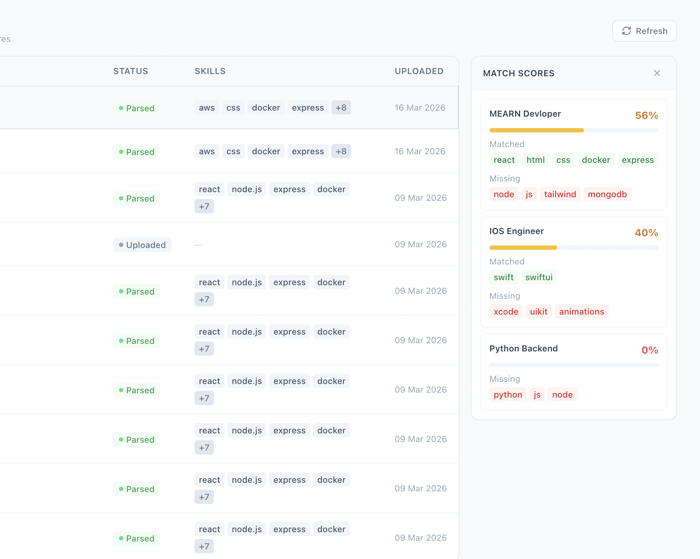 |

## High Level Architecture

| Architecture |  |

### Pipeline Flow

```
User uploads PDF
      │
      ▼
tusd → MinIO (object storage)
      │
      ▼ (webhook)
API creates ParsedResume record → pushes to ocr-queue
      │
      ▼
worker-ocr: download from MinIO → detect file type → extract raw text
      │
      ▼ → nlp-queue
worker-nlp: compromise + chrono-node → extract skills / experience / education
            → update ParsedResume status = 'parsed'
      │
      ▼ → match-queue
worker-match: fuzzy skill scoring
              → upsert MatchResults per job role
      │
      ▼ → insights-queue
worker-insights: aggregate analytics per user
                 → upsert DashboardAnalytics
```

---

## Monorepo Structure

```
resume-intelligence-hub/
├── apps/
│   ├── api/                    # Express + TypeScript REST API
│   ├── frontend-dashboard/     # React 19 + Vite + Tailwind dashboard
│   ├── worker-ocr/             # PDF / DOCX / image text extraction
│   ├── worker-nlp/             # Skill + experience NLP parsing
│   ├── worker-match/           # Job-resume fuzzy match scoring
│   ├── worker-insights/        # Analytics aggregation
│   └── worker-stats/           # Prometheus metrics server
├── packages/
│   ├── config/                 # Shared Zod env validation
│   ├── database/               # Sequelize models + connection
│   ├── logger/                 # Winston logger
│   └── queue-lib/              # BullMQ queues + worker factory
├── nginx/
│   └── nginx.conf
└── k8s/                        # Kubernetes manifests
```

---

## Kubernetes & Pod Autoscaling

The platform ships with a complete set of Kubernetes manifests under `k8s/`. The `worker-ocr` deployment is configured with a **Horizontal Pod Autoscaler** that scales based on CPU utilisation, allowing the system to handle burst upload loads automatically.

| CPU Intensive Work                             | Pod scaling                                     |
| ---------------------------------------------- | ----------------------------------------------- |
| 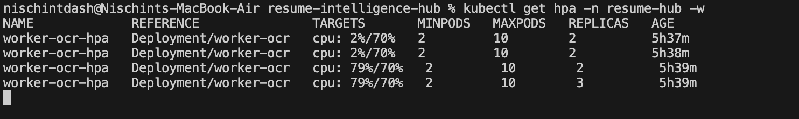 | 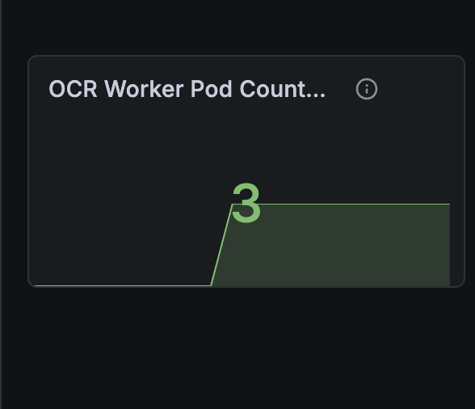 |

| Realtime Pod Upscaling                       | Realtime Pod Downscaling                     |
| -------------------------------------------- | -------------------------------------------- |
| 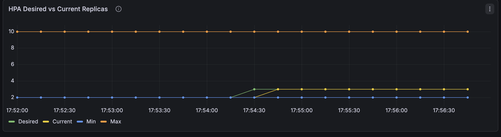 | 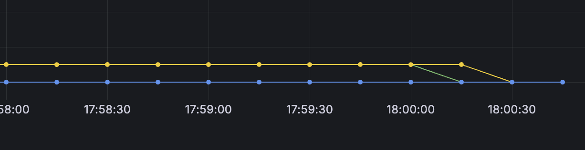 |

### Deploying to Kubernetes

```bash
# Create namespace
kubectl apply -f k8s/namespace.yaml

# Apply secrets and configmap
kubectl apply -f k8s/secret.yaml
kubectl apply -f k8s/configmap.yaml

# Infrastructure
kubectl apply -f k8s/postgres/
kubectl apply -f k8s/redis/
kubectl apply -f k8s/minio/

# Application services
kubectl apply -f k8s/api/
kubectl apply -f k8s/worker-ocr/
kubectl apply -f k8s/workers/

# Ingress
kubectl apply -f k8s/ingress.yaml

# Monitoring
kubectl apply -f k8s/monitoring/
```

---

## Running Locally with Docker Compose

### Prerequisites

- Docker Desktop
- `pnpm` (or use `npm install -g pnpm`)

### 1. Clone and configure

```bash
git clone https://github.com/nischintd/resume-intelligence-hub.git
cd resume-intelligence-hub

cp .env.example .env
# Fill in the required values in .env
```

### 2. Required `.env` values

```bash
# Build all services and start
docker compose up -d --build

# Watch logs
docker compose logs -f

# Check service health
docker compose ps
```

### 3. Build and start

### 4. Access

| Service            | URL                       |
| ------------------ | ------------------------- |
| Frontend           | http://localhost          |
| API                | http://localhost/api/v1   |
| API Docs (Swagger) | http://localhost/api-docs |
| MinIO Console      | http://localhost:9001     |
| tusd Upload        | http://localhost/files/   |

## API Reference

Full Swagger docs available at `/api-docs` when running locally. Key endpoints:

```
POST   /api/v1/auth/register
POST   /api/v1/auth/login

GET    /api/v1/resumes
POST   /api/v1/resumes
GET    /api/v1/resumes/:id
GET    /api/v1/resumes/:id/matches

GET    /api/v1/jobs
POST   /api/v1/jobs
PATCH  /api/v1/jobs/:id
DELETE /api/v1/jobs/:id

GET    /api/v1/analytics/dashboard
```

All routes except auth require `Authorization: Bearer <token>`.

---
